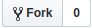

# Zero to Web in 8 Weeks
*An adult education course from Mirman School*

## About this Course 
Zero to Web in 8 Weeks is designed to introduce you to the basics of creating content for the web. The three languages we'll explore—HTML, CSS, and JavaScript—are the tools used to create rich experiences on desktops, laptops, and mobile devices. By the end of this course, you'll understand to to read and write these languages, as well as how to use them in concert to produce interactive web pages/applications.

### Prerequisites
None! We start at the absolute beginning.

### Materials
To participate in this course, you will need:

1. A laptop. Given our toolset, Mac is easier, but Windows machines will work just fine.
2. [Visual Studio Code](https://code.visualstudio.com/): This is our text editor of choice. Free to download for Windows or Mac.
3. [Git](https://git-scm.com): A version control system that  Although Mac comes with its own version of Git, I prefer to use the "official" release.
4. [GitHub](https://github.com): You'll need an account on GitHub. Make sure to remember your username and password; we'll use them both a lot!

## "I'm nervous. I've never done any coding before."
Everyone starts here. I did not take a single computer science course in college. The wonderful thing about this trade is how accessible it is to everyone! Yes, it can be frustrating at times, and it can certainly feel as though there's too much to learn.

One of the most important skills in software development is the ability to take big problems and break them down into small, easy-to-handle problems. So it is with this topic in general: one step at a time. We'll get there. You *can* do it!

## The First Step: Fork this Repository
No DNA splicing necessary here. In Git, a **Fork** is a personal copy of someone else's repository?

> But wait, isn't that plagiarism?!
>
> \- *You, just now*

You'll notice that, in addition to the `README.md` file in this repo that you're reading RIGHT NOW, there's a `LICENSE` file. Take a moment and read it over.

Right? It's like...anti-copyright. This permissive license from MIT is known as an "open source" license. You can read, copy, modify, and redistribute all the code found here in any way you like.

So you can copy this repo without fear of legal action. To do so, click the "Fork" button at the top of this page on GitHub.

Once you do, you'll have a copy of this repo attached to your GitHub account. This repository will be what you work from for the entirety of the course. As we move through the sections, you'll be making changes to a **local** (on your computer) copy of your repository.

### Vocabulary
There are a lot of special terms for Git. Luckily, GitHub has made a handy-dandy glossary. I'd bookmark it:

**[GitHub Glossary](https://help.github.com/articles/github-glossary/)**

## Clone your Fork
You can't directly edit files on GitHub. Well, you kinda can, but it's a very bad idea. Instead, you download a copy (**clone**) of the repo to a computer, work on it, then upload the changes back to GitHub. We're going to create this clone together.
